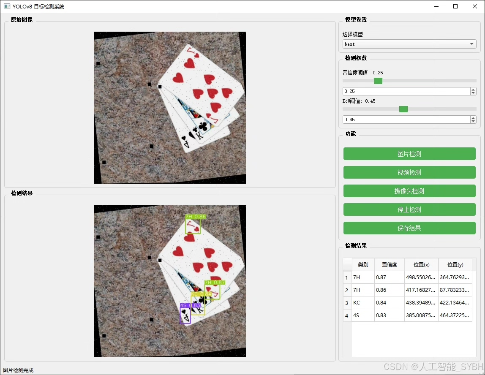
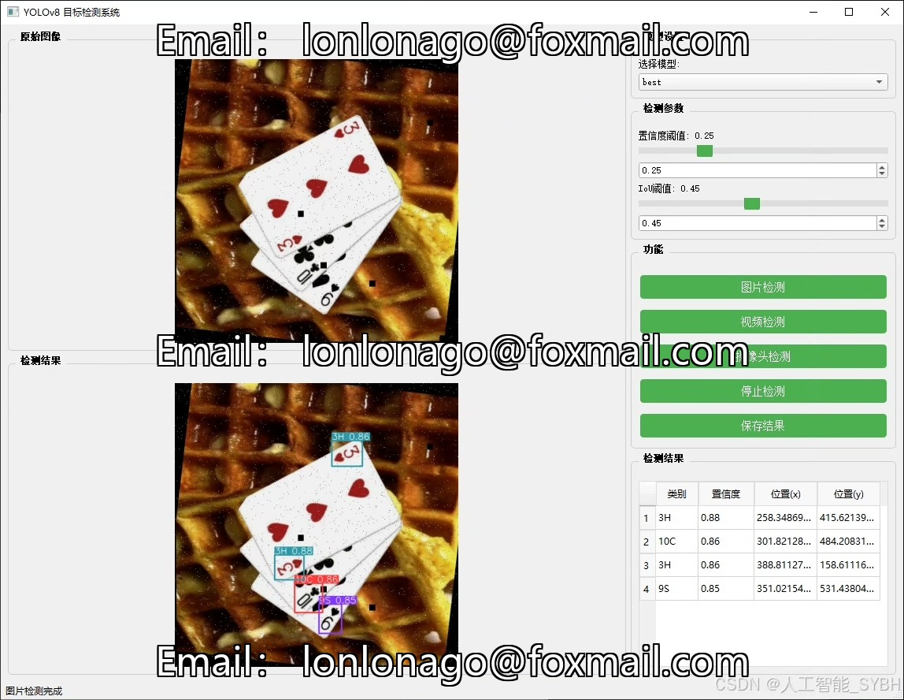
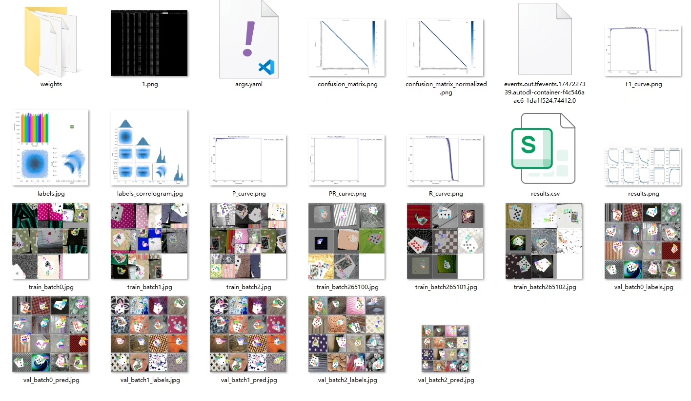
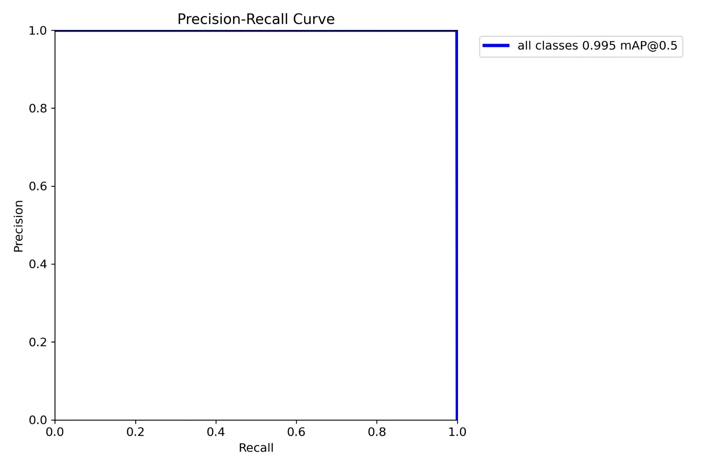
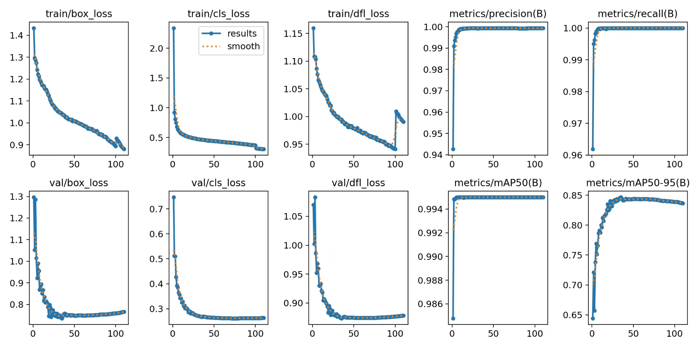
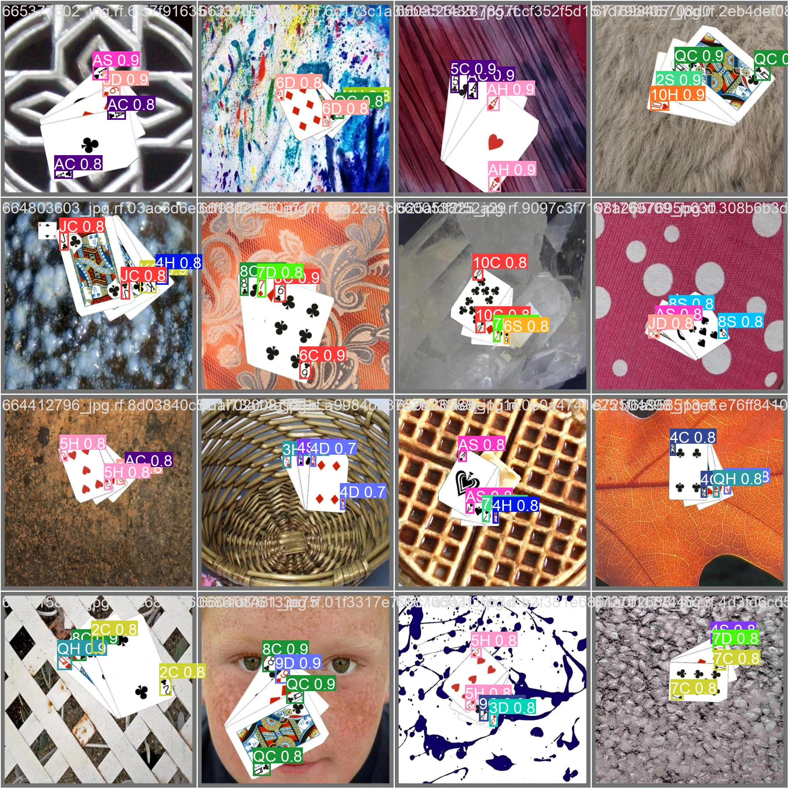
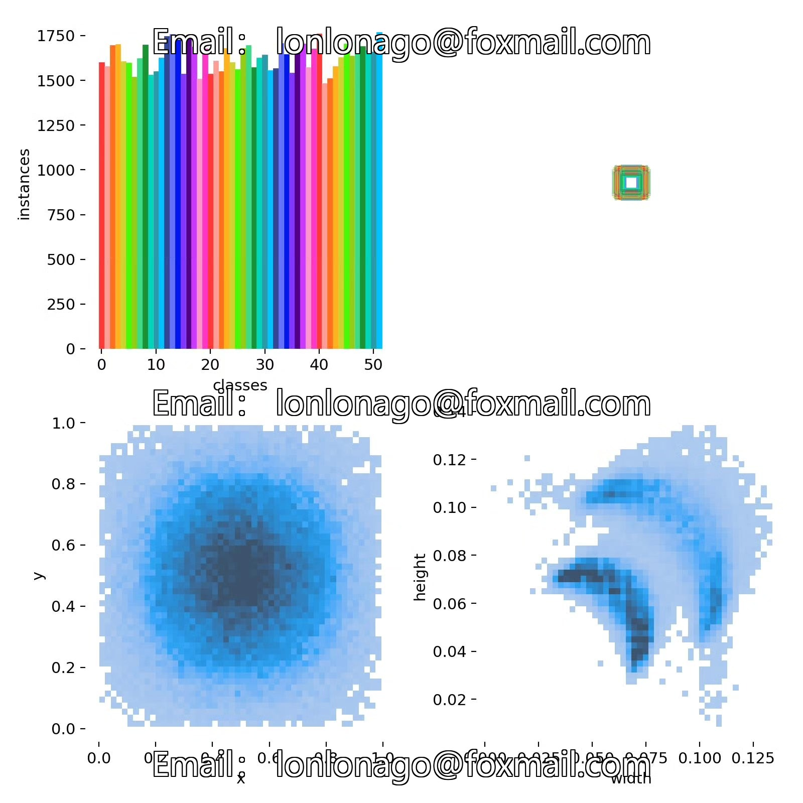
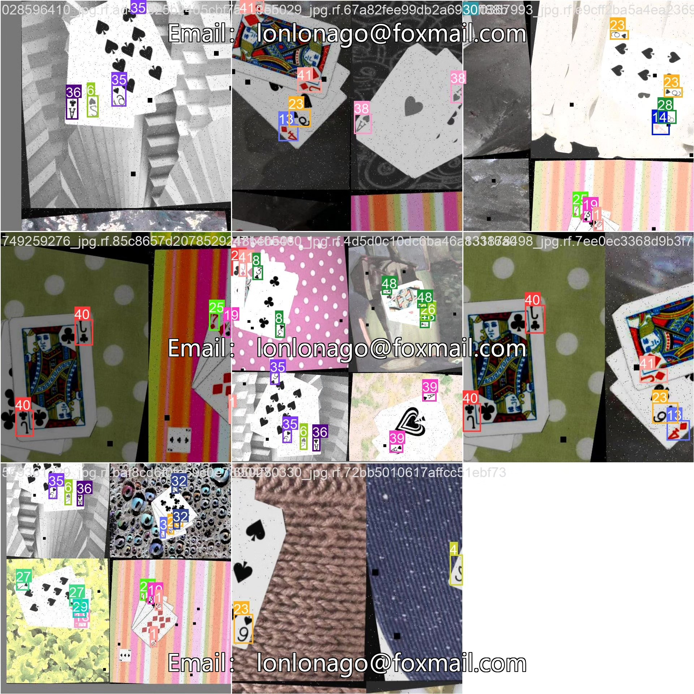

# Poker card recognition detection system based on deep learning YOLOv8+

## Body

Based on the advanced YOLOv8 object detection algorithm, this project has developed a high-precision poker card recognition and detection system. The system can identify and locate poker cards in real-time in images or video streams, accurately distinguishing 52 different types of poker cards (including all combinations from A to 10 and four suits of J, Q, K). The project uses a large-scale self-built dataset, including 21,203 training images, 2,020 validation images, and 1,010 test images, ensuring the model's generalization ability and robustness. This technology can be widely applied in fields such as casino surveillance, intelligent shuffle systems, poker game development, magic aid training, and more, bringing intelligent innovation to traditional paper game and entertainment industries.

The company's products have obtained YOLO official commercial license certification.

We provide after-sales service.

After payment, we will provide WeChat ID for any questions.

Environment configuration: We will provide an environment configuration tutorial, and WeChat will provide answers.

Remote installation service: If you need remote configuration, an additional fee of 69 is required.
If the configuration fails, all fees will be refunded (specially for old computers only refund installation fees).

Retraining dataset: After configuring the environment, you can train on your own computer.
If you need us to retrain, just pay 69 + computing power fees (2.5 yuan/hour)

## Images

## Payment

Here is a pay link on Stripe ( https://buy.stripe.com/3cs8yP7sY87d0vu9AB ). Please contact me lonlonago@foxmail.com after funding $89, and I will send you a complete data files , thank you!

